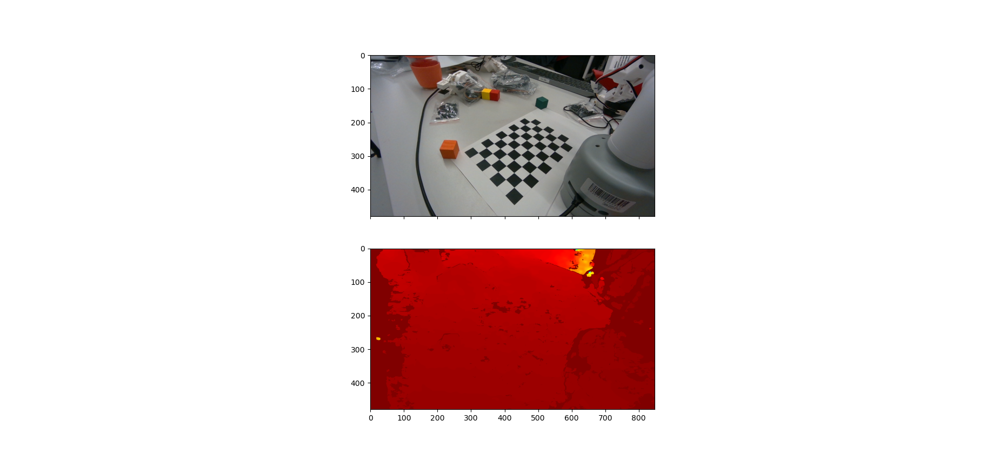
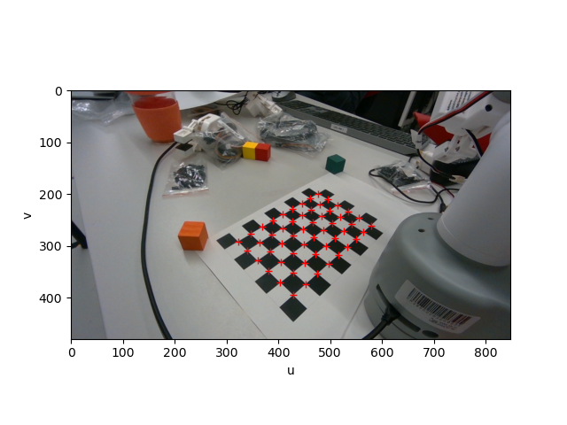

```
xhost +local:root; sudo docker run -it --network host --env="DISPLAY" --env="QT_X11_NO_MITSHM=1" --volume="/tmp/.X11-unix:/tmp/.X11-unix:rw" mzandtheraspberrypi/mycobot-client-humble:1.0.0; xhost -local:root;
ros2 run mycobot_client_2 cobot_ik
```


```
ros2 topic pub /mycobot/pose_goal mycobot_msgs_2/msg/MycobotPose "{frame: gripper, x: 0.04, y: -0.06, z: 0.45, rx: -40, ry: 0, rz: -75}" --once
ros2 topic pub /mycobot/pose_goal mycobot_msgs_2/msg/MycobotPose "{frame: gripper, x: 0.04, y: -0.06, z: 0.45, rx: -40, ry: 0, rz: -55}" --once
```


To visualize
```
apt install ros-humble-joint-state-publisher ros-humble-joint-state-publisher-gui ros-humble-xacro
ros2 launch mycobot_client_2 display.launch.py urdf_package:=mycobot_client_2 urdf_package_path:=models/elephant_description/mycobot_280_pi.urdf
```

# Camera Dev
To do camera dev, it is often very useful to record rosbag(s).

```
ros2 bag record /camera/realsense2_camera_node/color/image_rect_raw /camera/realsense2_camera_node/color/image_rect_raw/camera_info /camera/realsense2_camera_node/depth/image_rect_raw /camera/realsense2_camera_node/depth/image_rect_raw/camera_info /tf_static
```

You may then play these bag later and work on dev like camera calibration

## Camera Calibration
We have [designed a chessboard](https://github.com/VModugno/MycobotProps) that aligns with the robot's coordinate system so that we know where the points on the chessboard are in the robot's system. By using computer vision techniques to find the points on the chessboard in the camera's frame, we can then match the two pointclouds and calculate the rotation and translation from the robot to the camera. This is called the extrinsics.

There is a script in this repo `camera_extrinsics_via_procrustes.py` that does this. You can find some data that will serve as an input into this in the root of this repo in the `docs/raw_data` folder.




It outputs the transform from the camera frame to the robot frame (which is our world frame). To go the other direction invert it. The robot frame is on the table, in the middle of the base. It could be used like:

```python
global_recreated_via_transform = transformation @ xyz_cam
```

The below transform matrix was calculated with a Fiducial Residual Error of 0.00679, ~7mm.
```
[[-0.66195548, -0.42515663,  0.61729798,  0.12015741],
 [-0.74470073,  0.27958536, -0.6060139,   0.11123769],
 [ 0.08506335, -0.86085647, -0.50168751,  0.44884327],
 [ 0.,          0.,          0.,          1.,        ]]
```
